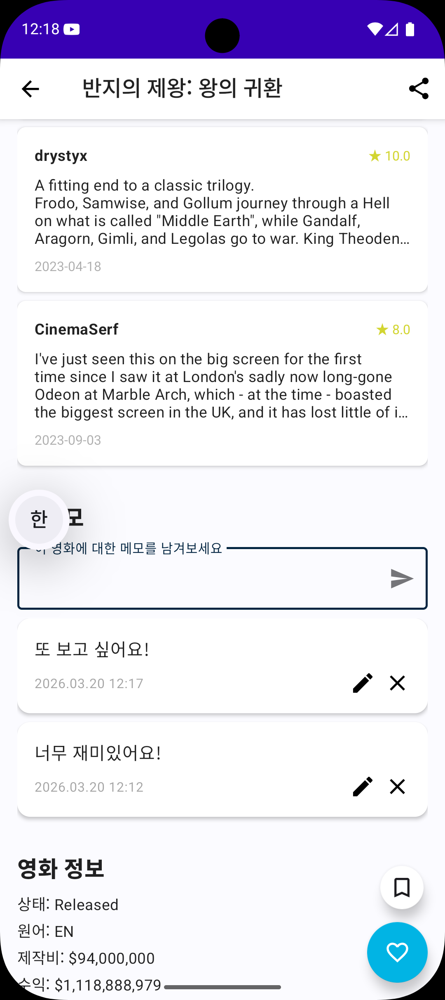

# AI 활용 기록 006 - oh-my-claudecode /team 멀티 에이전트 실험

> 5일차 ulw 모드에 이어, /team 모드로 3개 에이전트가 레이어별로 병렬 작업하는 실험 기록

## 목적

oh-my-claudecode의 `/team` 모드를 실험하여 ulw 모드와의 차이를 확인  
Clean Architecture의 3개 레이어(Data/Domain/Presentation)를 각각 다른 에이전트에게 맡겨 병렬 구현

## 사용한 도구

- Claude Code CLI (터미널)
- oh-my-claudecode v4.8.2 `/team` 모드
- 실험 대상 프로젝트: [MovieFinder](https://github.com/ChooJeongHo/MovieFinder)

---

## /team 모드란?

지정한 수의 에이전트를 생성하여 **독립적인 작업을 동시에** 처리하는 모드

```
/team 3:executor "작업 내용"
```

- 에이전트 간 의존성을 자동으로 파악하여 순서 조율
- 선행 작업이 완료된 후 후속 에이전트가 자동으로 시작
- 검증 에이전트가 별도로 결과물 확인

---

## 실험: 영화 메모 기능 추가

MovieFinder 상세 화면에 영화 메모를 남길 수 있는 기능을 `/team` 모드로 구현

### 요청한 프롬프트

```
/team 3:executor MovieFinder에 영화 메모 기능을 추가해줘.
Clean Architecture 레이어별로 나눠서 작업해줘:
- 에이전트 1 → Data 레이어 (MemoEntity, DAO, Repository 구현체)
- 에이전트 2 → Domain 레이어 (Memo 모델, Repository 인터페이스, UseCase)
- 에이전트 3 → Presentation 레이어 (MemoFragment, MemoViewModel, XML UI)
기존 코드 패턴(ErrorType, CancellationException rethrow, stateIn 등) 유지해줘.
```

---

## 에이전트 실행 흐름

```
worker-data    ──────────────────────────────────────────┐
                                                         ├──→ worker-presentation ──→ 검증 에이전트
worker-domain  ──────────────────────────────────────────┘
```

| 에이전트 | 태스크 | 상태 |
|----------|--------|------|
| worker-data | Data 레이어 (Entity, DAO, Repository 구현체, DI) | ✅ 완료 후 종료 |
| worker-domain | Domain 레이어 (Memo 모델, Repository 인터페이스, UseCase 4개) | ✅ 완료 후 종료 |
| worker-presentation | Presentation 레이어 (Adapter, XML, ViewModel/Fragment 수정) | ✅ Data + Domain 완료 후 시작 |
| verifier | 전체 결과물 검증 | ✅ PASS |

> Data + Domain은 **동시에** 작업, Presentation은 둘 다 완료된 후 자동 시작

**총 소요 시간: 31분 27초**

---

## 구현 결과

### 새로 생성된 파일 (11개)

| 레이어 | 파일 | 설명 |
|--------|------|------|
| Data | MemoEntity.kt | Room Entity (memos 테이블, movieId 인덱스) |
| Data | MemoDao.kt | DAO (Flow 조회, CRUD suspend 함수) |
| Domain | Memo.kt | 순수 Kotlin 도메인 모델 |
| Domain | GetMemosUseCase.kt | Flow 기반 메모 조회 |
| Domain | SaveMemoUseCase.kt | 메모 저장 |
| Domain | UpdateMemoUseCase.kt | 메모 수정 |
| Domain | DeleteMemoUseCase.kt | 메모 삭제 |
| Presentation | MemoAdapter.kt | ListAdapter (수정/삭제 콜백) |
| Presentation | item_memo.xml | MaterialCardView 메모 아이템 |
| Presentation | ic_edit.xml | Material 아이콘 |
| Presentation | ic_send.xml | Material 아이콘 |

### 수정된 파일 (9개)

- MovieDatabase.kt — version 10→11, MemoEntity 등록
- DatabaseModule.kt — MemoDao provider 추가
- MovieRepositoryImpl.kt — memo CRUD 4개 메서드 구현
- MovieRepository.kt — memo 인터페이스 4개 메서드 추가
- DetailViewModel.kt — UseCase 4개 주입, memos StateFlow, launchWithSnackbar 패턴
- DetailFragment.kt — MemoAdapter, 입력/수정 다이얼로그, onDestroyView 정리
- fragment_detail.xml — 메모 섹션 (TextInputLayout + RecyclerView)
- strings.xml / strings-en.xml — 한국어/영어 문자열 10개씩

---

## 실행 화면



> 영화 상세 화면 하단에 메모 입력창 + 저장된 메모 목록 (수정/삭제 가능)

---

## ulw 모드 vs /team 모드 비교

| 비교 항목 | ulw 모드 (5일차) | /team 모드 (6일차) |
|-----------|----------------|------------------|
| 에이전트 수 | 자동 결정 | 명시적으로 지정 (3개) |
| 작업 분배 | AI가 알아서 분배 | 직접 역할 지정 가능 |
| 의존성 처리 | 자동 | 자동 (Data/Domain 완료 후 Presentation 시작) |
| 적합한 상황 | 빠른 병렬 처리 | 역할이 명확히 나뉘는 복잡한 작업 |
| 검증 | 자동 | 별도 검증 에이전트 실행 |

---

## 느낀 점

`/team` 모드는 **역할을 명확히 지정할 수 있다**는 게 ulw 모드와 가장 큰 차이였다.

Clean Architecture처럼 레이어가 명확히 나뉜 프로젝트에서 특히 강력했다.  
Data와 Domain 에이전트가 동시에 작업하고, Presentation 에이전트가 그 결과를 받아서 자동으로 시작하는 흐름이 인상적이었다.

에이전트들이 서로의 완료 상태를 인식하고 의존성을 자동으로 처리한다는 점도 놀라웠다.  
사람이 팀으로 작업할 때처럼, AI도 역할을 나누면 더 체계적으로 돌아간다는 걸 직접 확인했다.

---

*실험 대상: [ChooJeongHo/MovieFinder](https://github.com/ChooJeongHo/MovieFinder)*  
*작성일: 2026-03-20*
