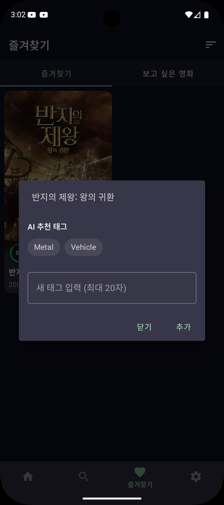

# AI 활용 기록 011 - Context7 MCP + ML Kit 영화 태그 AI 추천

> Context7 MCP로 ML Kit 공식 문서를 실시간 참조하여 영화 포스터 분석 기반 AI 태그 추천 기능 구현

## 목적

Context7 MCP가 실제로 작동하는 상황을 만들어 검증  
기존 코드에 없는 **완전 새로운 라이브러리(ML Kit)**를 도입하여 Context7의 실시간 문서 참조 효과 확인

## 사용한 도구

- Claude Code CLI (터미널)
- Context7 MCP (`@upstash/context7-mcp`)
- Google ML Kit Image Labeling (`com.google.mlkit:image-labeling:17.0.9`)
- 대상 프로젝트: [MovieFinder](https://github.com/ChooJeongHo/MovieFinder)

---

## Context7 MCP란?

Claude Code가 코드를 작성할 때 라이브러리 공식 문서를 실시간으로 참조할 수 있게 해주는 MCP 서버

| 구분 | Context7 없을 때 | Context7 있을 때 |
|------|----------------|----------------|
| 참조 소스 | Claude 학습 데이터 (구버전 가능) | 공식 문서 실시간 참조 |
| 버전 정확도 | 낮을 수 있음 | 최신 버전 정확히 적용 |
| 새 라이브러리 | 모를 수 있음 | 문서 기반 정확한 구현 |
| 기존 코드 많은 프로젝트 | 기존 패턴으로 충분 | 큰 차이 없음 |

### 설치 방법

```bash
# Claude Code 밖 일반 터미널에서
claude mcp add --scope user context7 -- npx -y @upstash/context7-mcp
```

---

## 8일차와의 차이

| 구분 | 8일차 (CLAUDE.md) | 11일차 (Context7) |
|------|-----------------|-----------------|
| 실험 결과 | 기존 코드가 많으면 차이 없음 | 새 라이브러리에서 효과 확인 |
| 이유 | 코드가 이미 컨텍스트 역할 | 코드에 없는 라이브러리 → 문서 필요 |

**핵심 교훈:** Context7은 기존 코드 패턴을 따르는 구현이 아닌, **처음 쓰는 라이브러리**에서 진짜 효과가 나온다

---

## Context7 실제 작동 확인

```
use context7 to find documentation for Google ML Kit image labeling for Android
```

Context7이 실제로 참조한 내용:
- 라이브러리 ID: `/websites/developers_google_ml-kit_guides`
- 총 **2회 쿼리**, **11,082개 코드 스니펫** 검색
- 훈련 데이터가 아닌 **실시간 공식 문서**에서 가져온 내용

공식 문서에서 참조한 핵심 패턴:
```kotlin
// Context7이 공식 문서에서 가져온 ML Kit 사용 패턴
val options = ImageLabelerOptions.Builder()
    .setConfidenceThreshold(0.5f)
    .build()
val labeler = ImageLabeling.getClient(options)

labeler.process(image)
    .addOnSuccessListener { labels ->
        for (label in labels) {
            val text = label.text
            val confidence = label.confidence
        }
    }
```

---

## 구현 내용

### 1단계 - 영화 태그 기능 (Room DB v12)

| 파일 | 내용 |
|------|------|
| MovieTagEntity.kt | movieId + tagName 복합 unique 인덱스 |
| MovieTagDao.kt | 태그 CRUD + 즐겨찾기 JOIN 쿼리 |
| TagRepository.kt / TagRepositoryImpl.kt | Repository 패턴 |
| GetTagsForMovieUseCase 외 4개 | UseCase 분리 |
| FavoriteViewModel.kt | 태그 필터 StateFlow 추가 |
| FavoriteFragment.kt | ChipGroup 태그 필터 UI |

### 2단계 - ML Kit AI 태그 추천

| 파일 | 내용 |
|------|------|
| PosterTagSuggester.kt | @Singleton, Coil로 포스터 비트맵 로드 → ML Kit 레이블링 → 추천 태그 반환 |
| dialog_manage_tags.xml | AI 추천 태그 섹션 (ProgressBar + ChipGroup) |

**동작 흐름:**
```
즐겨찾기 화면에서 영화 카드 롱프레스
    ↓
태그 관리 다이얼로그 열림
    ↓
Coil로 포스터 이미지 비트맵 로드
    ↓
ML Kit Image Labeling (confidence ≥ 0.50)
    ↓
무의미 레이블 제외 ("Poster", "Font", "Text", "Logo", "Brand")
    ↓
최대 5개 AI 추천 태그 칩으로 표시
    ↓
칩 탭 → 입력창 자동 채움 → 추가 버튼으로 태그 저장
```

---

## 실행 결과

### AI 태그 추천 작동 확인



반지의 제왕: 왕의 귀환 포스터 분석 결과:
- **Metal** (갑옷 인식)
- **Vehicle** (말 인식)

ML Kit 일반 모델이라 영화 맥락을 직접 이해하진 않지만, 이미지 객체 인식 기반으로 의미있는 태그를 자동 추천함

---

## 트러블슈팅

| 오류 | 원인 | 해결 |
|------|------|------|
| `Error inflating class TextView` | `?attr/textAppearanceBodySmall`이 다이얼로그 컨텍스트에서 미지원 | `@style/TextAppearance.MaterialComponents.Caption`으로 직접 지정 |
| AI 추천 태그 없음 | Confidence threshold 0.70이 너무 높음 + 블록리스트 과다 | threshold 0.50으로 낮춤, 블록리스트 21개 → 5개로 축소 |

---

## 느낀 점

Context7은 8일차 실험에서 효과가 없었는데, 이번엔 확실히 달랐다.

처음 쓰는 ML Kit 라이브러리를 도입할 때 Context7이 실시간으로 공식 문서를 참조해서 정확한 버전(17.0.9)과 API 패턴을 바로 가져왔다. 학습 데이터에서 가져오는 것과 명확히 다른 점은 "11,082개 스니펫 중 검색"이라는 과정이 실제로 일어난 것이다.

**Context7 사용 기준:**
- 새로운 라이브러리 처음 도입할 때 → **효과 큼**
- 기존 코드 패턴을 따르는 구현 → 불필요

---

*실험 대상: [ChooJeongHo/MovieFinder](https://github.com/ChooJeongHo/MovieFinder)*  
*작성일: 2026-04-01*
