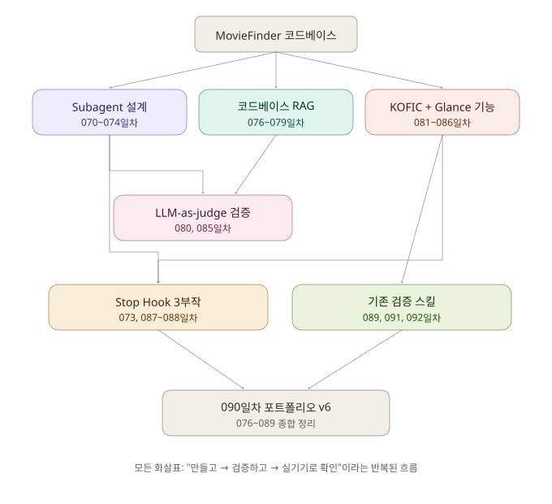

# 093 - 070~092일차 아키텍처 다이어그램 정리

**15일 주기 Summary(텍스트)와는 별개로, 070~092일차에서 만든 컴포넌트들이 실제로 어떻게 서로 연결되어 쓰였는지 그림 한 장으로 정리했다**

---

## 목적

090일차 PORTFOLIO_v6.md가 076~089일차를 텍스트로 정리했다면, 093일차는 070~092일차 전체를 시각 자료 한 장으로 정리한다. 15일 주기 Summary와 겹치지 않는, 완전히 별개의 작업이다.

| | Summary (090일차 등) | 아키텍처 다이어그램 (093일차) |
|---|---|---|
| 형식 | 텍스트 (PORTFOLIO_vX.md) | 시각 자료 (SVG) |
| 내용 | 실험별 핵심 결과, 배운 교훈 | 컴포넌트 간 연결 관계 |
| 주기 | 정해진 규칙(14일+1일) | 필요할 때 한 번 |

---

## 다이어그램

---

## 핵심 흐름

- 070~074일차(Subagent 설계)의 산출물이 076~079일차(RAG)와 081~086일차(KOFIC+Glance 실제 기능) 양쪽으로 이어졌다.
- 두 갈래 모두 080/085일차(LLM-as-judge 검증)를 거쳤다.
- 073/087~088일차(Stop Hook 3부작)이 "실기기 확인"을 시스템으로 강제하며 실제 기능 개발 과정에 개입했다.
- 089/091/092일차(기존 검증 스킬)가 마지막으로 실제 기능(KOFIC+Glance) 쪽을 재점검했다.
- 090일차 포트폴리오가 이 전체를 텍스트로 종합했다.

## 왜 이 그림이 의미 있는가

070~092일차 실험들은 매일 다른 주제처럼 보이지만, 실제로는 뒤에 한 작업이 앞에서 만든 걸 계속 재사용했다. 070일차 리뷰어가 081~086일차 기능 개발에 실제로 쓰였고, 073일차 안전장치가 그 개발 과정을 실기기 검증 없이는 못 끝내게 막았다. 글로만 봐서는 잘 안 보이던 이 재사용 관계가, 그림으로 보면 한눈에 들어온다.

---

*실험 대상: [ChooJeongHo/MovieFinder](https://github.com/ChooJeongHo/MovieFinder)*
*작성일: 2026-08-13*
